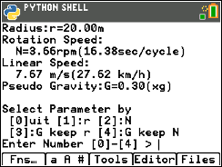

# Centrifugal-Force-Calc

This project shares a small Python program GRAVITY.py, which calculates pseudo centrifugal force produced by rotation of spaceships, space stations, or space islands.

GRAVITY.py supports SFF writers who are writing space development stories.



## Prompt

GRAVITY.py tells a model space station specs, which produces 1G (9.8m^2) on startup.

```
Radius:r=894.70m
Rotation:N=1.00rpm(60.00sec/cycle)
Linear Speed: 93.69 m/s(337.29 km/h)
Pseudo Gravity:G=1.00(xg)
```

Below the startup prompt, GRAVITY.py asks you which parameter you want to change.

```
Select Parameter by 
 [0]uit [1]:r [2]:N 
 [3]:G keep r [4]:G keep N
Enter Number [0]-[4] > 
```

If you want to know the rotation speed of the Carousel, which is a deck of Discovery ONE in Space Odessey 2001, set the radius at first.  Enter \[1\] and 12 (meter).  You will get the centrifugal force by 12-meter radius Carusel rotating 1 rpm.

```
Enter Number [0]-[4] > 1
enter Radius of wheels by meter(m) >> 12
Radius:r=12.00m
Rotation:N=1.00rpm(60.00sec/cycle)
Linear Speed: 1.26 m/s(4.52 km/h)
Pseudo Gravity:G=0.01(xg)
```

0.01G is too small by Clarke's setting.  He wrote the force was identical to the Moon, 0.16G.  Then set G with keeping \[r\]adius.

Enter 3 to set gravity with keeping radius, and enter 0.16 (+g).  You will get 3.45 rpm (17.37-seconds cycle).

```
enter GA m/s^2 with keep r >> 0.16
Radius:r=12.00m
Rotation:N=3.45rpm(17.37sec/cycle)
Linear Speed: 4.34 m/s(15.62 km/h)
Pseudo Gravity:G=0.16(xg)
```


## Requirement

GRAVITY.py requires python 2.0 or higher, tested on Graphing calculator [TI84 Plus CE Python](https://education.ti.com/en/products/calculators/graphing-calculators/ti-84-plus-ce-python).

